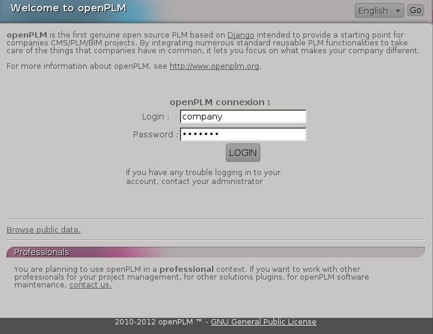

========================================================
Installation de OpenPLM serveur version de développement
========================================================

Ce document décrit l'installation d'un serveur OpenPLM à partir de la version
de développement.

Prérequis
==========

Ce tutoriel a été réalisé à l'aide des logiciels suivant :

    * Debian Squeeze
    * Apache Server version: Apache/2.2.16
    * PostgreSQL 8.4.4
    * Python 2.6.X
    * Django 1.2.X
    * Celery 2.3.X
    * Haystack 1.2.X
    * Xapian 1.2.X
    * Lepl 5.0
    * South 0.7.3
 
 
.. note::

    Le framework Django fonctionne aussi avec des bases de données SQLite 3 et
    MySQL, ainsi qu'avec d'autres serveurs web. Tout retour sur des
    installations basées sur ces combinaisons sont les bienvenues. Pour plus
    d'information, vous pouvez consulter le `site web de Django
    <http://www.djangoproject.com/>`_

Installation des paquets nécessaires
====================================

Pour commencer, il faut satisfaire quelques dépendances :

    #. ``apt-get install swig build-essential pkg-config gettext``
    #. ``apt-get install apache2 libapache2-mod-wsgi``
    #. ``apt-get install python-pip python-dev python-imaging python-kjbuckets python-pypdf ipython``
    #. ``pip install odfpy``
    #. ``apt-get install graphviz graphviz-dev``
    #. ``pip install 'pygraphviz>=1.1'``
    #. ``apt-get install python-xapian rabbitmq-server``
    #. ``apt-get install python-django python-docutils``
    #. ``pip install 'south>=0.7'``
    #. ``pip install celery``
    #. ``pip install django-celery``
    #. ``pip install 'django-haystack<2'``
    #. ``apt-get install postgresql python-psycopg2``
    #. ``pip install lepl``
    #. ``apt-get install python-pisa``
    #. ``apt-get install libgsf-bin``

Les dépendances suivantes sont aussi nécessaires pour permettre la recherche
textuelle dans les fichiers :

    #. ``apt-get install poppler-utils html2text odt2txt antiword catdoc``
    #. ``pip install openxmllib``

Récupération du code source via Subversion
==========================================

    * ``apt-get install subversion``
    
    * ``mkdir /var/django``
    
Tout les fichiers utilisés par un nouveau site django seront stockés dans ce
répertoire.
    
    * ``cd /var/django``
    
    * ``svn co svn://openplm.org/openPLM``
    
Le répertoire ./openPLM est créé et le code source y est téléchargé.
    
    * ``cd /var/django/openPLM``

Configuration de PostgreSQL
===========================
    
    * ``mkdir /var/postgres``
    * ``chown postgres:postgres /var/postgres/``
    * ``find / -name initdb`` ::
    
        /usr/lib/postgresql/8.4/bin/initdb
        
    * ``locale-gen fr_FR.UTF-8``
      (remplacer ``fr_FR.UTF-8`` avec la locale utilisée) 
    * ``su postgres``
    * ``/usr/lib/postgresql/8.4/bin/initdb --encoding=UTF-8 --locale=fr_FR.UTF-8 --pgdata=/var/postgres/``
    * ``/usr/lib/postgresql/8.4/bin/postgres -D /var/postgres &``
      (ce n'est pas un problème si postgres est déjà lancé, il n'est pas
      nécessaire de le redémarrer.)
    * ``psql``:

        .. code-block:: psql
    
            postgres=#create database openplm;
            postgres=#create role django with password 'MyPassword' login;
            \q
    
    * ``exit``

Changer la clé secrète
======================

    * ``cd /var/django/openPLM/trunk/openPLM/``
    * ``python bin/change_secret_key.py``
        
Créer la base de données
========================

Éditer le fichier :file:`/var/django/openPLM/settings.py` 
et définir le mot de passe de la base ('MyPassword').
Il s'agit du mot de passe défini avec la commande ``create role django with password 'MyPassword' login;``
Ici l'utilisateur base de donnée (DATABASE_USER) est ``django``, et non pas
l'administrateur Django créé avec ``./manage.py syncdb --all``.

Par example:

.. code-block:: python
    :emphasize-lines: 7 

    # settings.py
    DATABASES = {
        'default': {
            'ENGINE': 'django.db.backends.postgresql_psycopg2', # or 'postgresql', 'mysql', 'sqlite3', 'oracle'.
            'NAME': 'openplm',               # Or path to database file if using sqlite3.
            'USER': 'django',                # Not used with sqlite3.
            'PASSWORD': 'MyPassword',        # Not used with sqlite3.
            'HOST': 'localhost',             # Set to empty string for localhost. Not used with sqlite3.
            'PORT': '',                      # Set to empty string for default. Not used with sqlite3.
        }
    }

On exécute ensuite les commandes suivantes : 

    * ``cd /var/django/openPLM/trunk/openPLM/``
    * ``./manage.py syncdb --all``
    * ``./manage.py migrate --all --fake``
    
    .. note::
        Vous devez créer un utilisateur superadmin pour Django, ainsi qu'un
        utilisateur spécial appelé 'company'.
        superadmin est utilisé pour administrer openPLM via l'interface
        d'administration.
        company permet d'accéder à tout le contenu de openPLM et devrait être
        devrait être utilisé pour sponsoriser d'autres utilisateurs.

Compilation des fichiers de traduction
======================================

Exécuter les commandes suivantes :
    
    #. ``make``
    #. ``./bin/translate_all.sh compile all``.
   
Configuration du stockage des fichiers
======================================

Création du répertoire où seront stocker les fichiers uploader : 
    
    * ``mkdir /var/openPLM``
    
On ajuste les droits : 
    
    * ``chown www-data:www-data /var/openPLM``
     
On ajuste aussi les droits pour le répertoire où sont stockés les aperçus : 
    
    * ``chown www-data:www-data /var/django/openPLM/trunk/openPLM/media/thumbnails``
 
.. _search-engine-svn:

Configuration du moteur de recherche
====================================

Bien que haystack supporte plusieurs moteurs de recherche, openPLM utilise
xapian.
Si vous souhaitez stocker les index dans un autre répertoire, vous devez
modifier la variable `HAYSTACK_XAPIAN_PATH` dans le fichier settings.py.

Une fois haystack configuré, il faut reconstruire l'index : 

    * ``./manage.py rebuild_index``
    * ``chown www-data:www-data -R /var/openPLM/xapian_index/``
   
.. _celery-svn:

Configuration de Celery
=======================

openPLM utilise Celery pour gérer les taches asynchrones. Celery a besoin d'un
'broker', vous pouvez utiliser n'importe quel 'broker' supporter par Celery,
mais *rabbitmq* est recommandé.

Pour configurer rabbitmq, il faut créer un utilisateur et un vhost (en tant
qu'utilisateur root) : 

    * ``service rabbitmq-server start``
    * ``rabbitmqctl add_user openplm 'secret'``
      (changer le mot de passe, utiliser des simple quotes pour spécifier des
      charactères spéciaux ou des espaces.)
    * ``rabbitmqctl add_vhost openplm``
    * ``rabbitmqctl set_permissions -p openplm openplm ".*" ".*" ".*"``

Il faut ensuite modifier les paramètres `BROKER_*` dans le fichier
:file:`settings.py`. Si vous suivez ce tutoriel, il vous suivez d'adapter le
mot de passe `BROKER_PASSWORD`.

Par exemple :

.. code-block:: python
    :emphasize-lines: 5

    # settings.py 
    BROKER_HOST = "localhost"
    BROKER_PORT = 5672
    BROKER_USER = "openplm"
    BROKER_PASSWORD = "secret"
    BROKER_VHOST = "openplm"

:command:`celeryd`, le démon Celeryc doit être lancé. openPLM comprend un script de démarrage:

    * ``cp /var/django/openPLM/trunk/openPLM/etc/init.d/celeryd /etc/init.d/celeryd``
    * ``cp /var/django/openPLM/trunk/openPLM/etc/default/celeryd /etc/default/celeryd``
    * ``chmod +x /etc/init.d/celeryd``
    * ``mkdir /var/log/celery``
    * ``mkdir /var/run/celery``
    * ``chown www-data:www-data /var/log/celery /var/run/celery``

Pour lancer :command:`celeryd`, exécuter ``/etc/init.d/celeryd start``.

Vérification des modules requis
===============================
    
    * ``./bin/check_modules.py`` ::
    
        /usr/local/lib/python2.6/dist-packages/pyPdf-1.12-py2.6.egg/pyPdf/pdf.py:52: DeprecationWarning: the sets module is deprecated
        from sets import ImmutableSet
        All is ok

Configuration du serveur Apache
===============================

Éditer le fichier de configuration d'Apache (:file:`/etc/apache2/httpd.conf`) et ajouter les lignes suivantes :
    
.. literalinclude:: apache/simple.conf
    :language: apache

Redémarrage du serveur Apache
=============================

    * ``service apache2 restart``

Premiers pas sur OpenPLM
========================

Ajout d'utilisateurs
--------------------

Il y a deux façons possible d'ajouter des utilisateurs. La première méthode
s'effectue directement depuis OpenPLM, dans l'onglet délégation. La deuxième
méthode utilise l'interface d'administration.

Méthode recommandée
~~~~~~~~~~~~~~~~~~~

La première méthode est la méthode recommandée pour ajouter des utilisateurs
dans OpenPLM. Elle nécessite que la configuration email d'OpenPLM soit
fonctionnelle.

Connecter vous sur OpenPLM. Si vous venez tout juste de terminer
l'installation, vous pouvez vous connecter avec l'utilisateur company créé
plus tôt.

Ouvrer votre navigateur et accéder à la page suivante : ::

    http://your_site_address/
    
.. note:: your_site_adress est donnée à titre d'exemple, il vous faut utiliser l'adresse de votre instance d'OpenPLM

Ensuite suivez les instructions décrites dans :ref:`add-user`

Créer d'autres utilisateurs si nécessaire, puis déconnectez vous et
reconnectez vous depuis votre nouveau compte utilisateur.

Deuxième méthode
~~~~~~~~~~~~~~~~

La deuxième méthode pour ajouter des utilisateurs n'est **pas** recommandée.
Les choses peuvent mal tourner : problèmes de droits, mauvais référencement,
etc
La seule raison d'utiliser cette méthode est qu'elle ne nécessite pas une
configuration email fonctionnelle. Mais il est quand même conseillé de prendre
quelques minutes de plus pour configurer les emails et utiliser la première
méthode.

Ouvrer votre navigateur web et aller sur la page : ::

    http://your_site_address/admin/
    
.. note:: your_site_adress est donné en exemple, vous devez bien sur utiliser votre propre adresse 

Identifier vous en tant que superadmin : 

.. image:: images/admin_login.png

Si vous obtenez une erreur IOError (socket closed), vérifiez vos paramètres,
notamment tout ce qui est liée à Celery et RabbitMQ

Vous pouvez ajouter un nouvel utilisateur et éditer son profil en allant sur Home>Auth>User :

.. image:: images/admin_user.png

N'oubliez pas d'éditer Home>Plmapp>User profiles pour lui attribuer les bons droits d'accès à openPLM :

.. image:: images/admin_userprofile.png

.. note::
    Pour plus d'information sur l'utilisation du `Django admin tool <http://docs.djangoproject.com/en/dev/intro/tutorial02/>`_ . 

Maintenant, il vous faut créer un nouveau *Site* (utilisez l'interface
d'administration) et renseignez la valeur de la variable `SITE_ID` dans le fichier :file:`settings.py`.

Vous êtes maintenant prêt pour votre première connexion : ::

    http://localhost/
    
.. image:: images/openplm_connexion.png

Forcer la connexion HTTPS
==============================

Si votre serveur apache supporte HTTPS, vous pouvez forcer l'utilisation de
connexions HTTPS en changeant à ``True`` la valeur des variables :const:`FORCE_HTTPS` et 
:const:`SESSION_COOKIE_SECURE` dans le fichier :file:`settings.py`.

Toutes les connexion HTTP seront rediriger sur des connexions HTTPS.

Une configuration possible de apache (avec les modules rewrite et ssl activés) :

.. literalinclude:: apache/ssl.conf
    :language: apache

Configuration des Emails
=========================

Pour configurer l'envoi d'emails, plusieurs variables sont à votre
disposition dans le fichier :file:`settings.py`. 
Vous pouvez vous référer à la `documentation Django <https://docs.djangoproject.com/en/dev/ref/settings/#std:setting-EMAIL_HOST>`_ pour plus de détails.

OpenPLM ajoute à celles-ci une variable `EMAIL_OPENPLM`, qui permet d'indiquer
l'adresse mail spécifier dans le champ `de` (`from`) de chaque e-mail. Il
s'agit habituellement d'une adresse en `no-reply@`.

Dépannage
=========

.. contents::
    :local:

Les pages d'administrations sont moches
---------------------------------------

openPLM utilise un lien symbolique (:file:`/path/to/openPLM/media/admin`) qui peut être erroné sur votre système.

La commande suivante le corrigera :
``ln -s `python -c 'import django; print django.__path__[0]'`/contrib/admin/media
/var/django/openPLM/trunk/openPLM/media/admin``

Connexion refusée
-----------------

Cette erreur indique en général une mauvaise configuration de Celery qui ne
peut pas se connecter à RabbitMQ

Voir :ref:`celery` pour plus de détails, assurez vous que RabbitMQ est bien lancé et vérifier les variables `BROKER_*` dans le fichier :file:`settings.py`.

IOError at /object/create -- Socket closed
------------------------------------------

Voir `Connexion refusée`_.

Je ne trouve aucun objets
--------------------------

Vous pouvez reconstruire l'index du moteur de recherche (:ref:`search-engine`) et vérifier si openPLM trouve les objets.

Il est possible que celery n'arrive pas à mettre à jour l'index de recherche.
Vérifier si le fichier de log de celery (:file:`/var/log/celery/*.log`)
contient une ligne ressemblant à ``[.. INFO/MainProcess] Got task from broker: openPLM.plmapp.tasks.update_index[...]``. Il peut s'agir d'un problème de droits que 
``chown www-data:www-data -R /var/openPLM/xapian_index/`` pourrai réparer.

J'arrive à me connecter à http://server/ mais j'arrive toujours sur une page "It works"
---------------------------------------------------------------------------------------

Il peut y avoir un problème avec le serveur apache. L'URL http://server/home/
offre-t-elle un résultat plus acceptable ?
