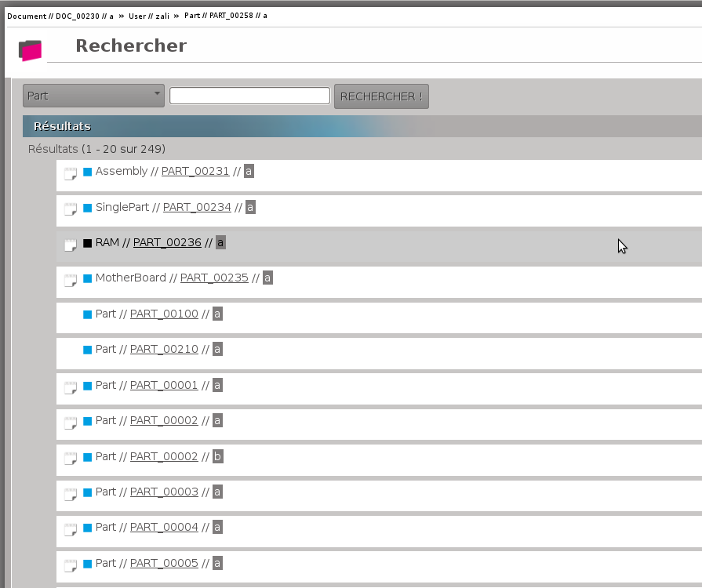
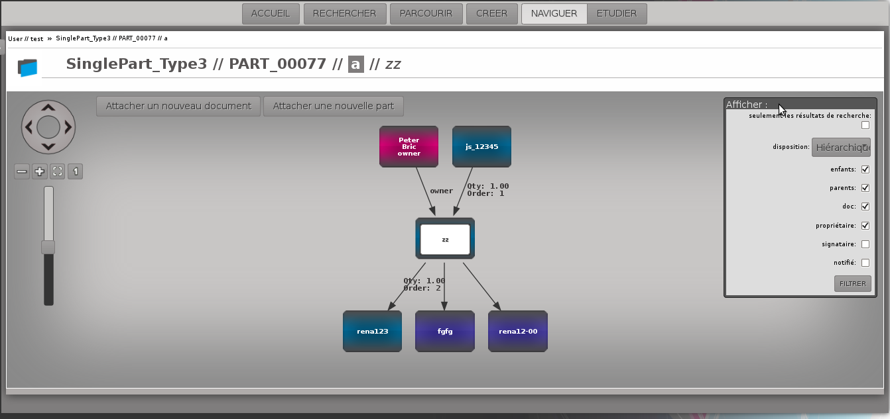
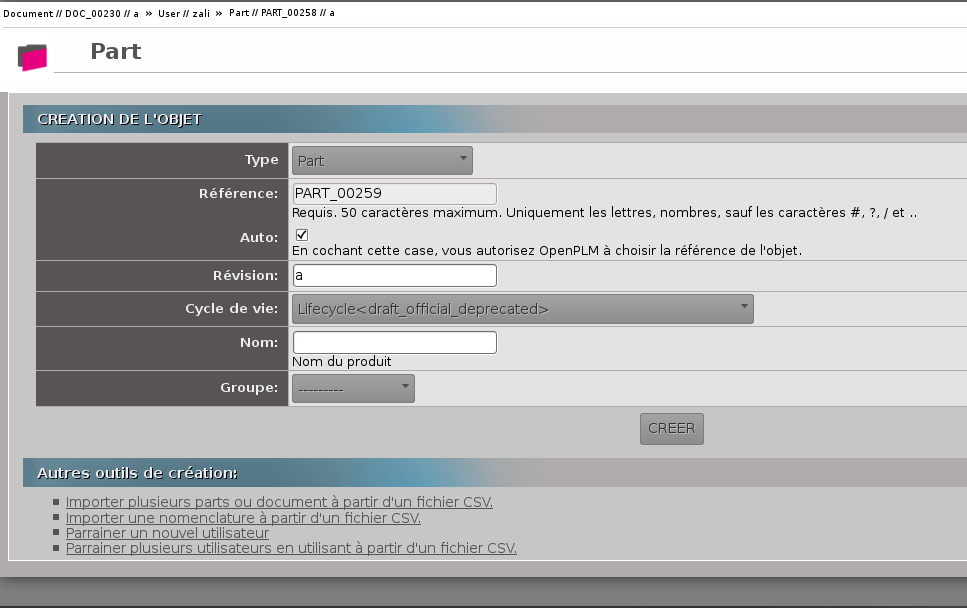
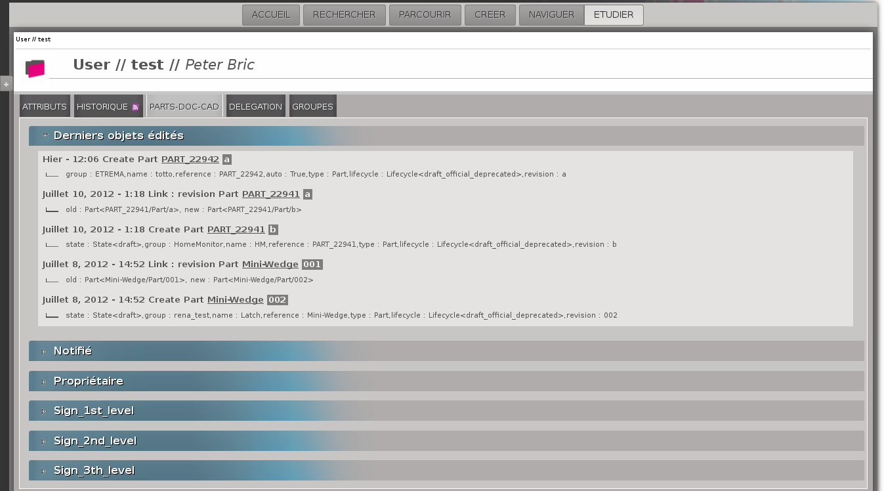
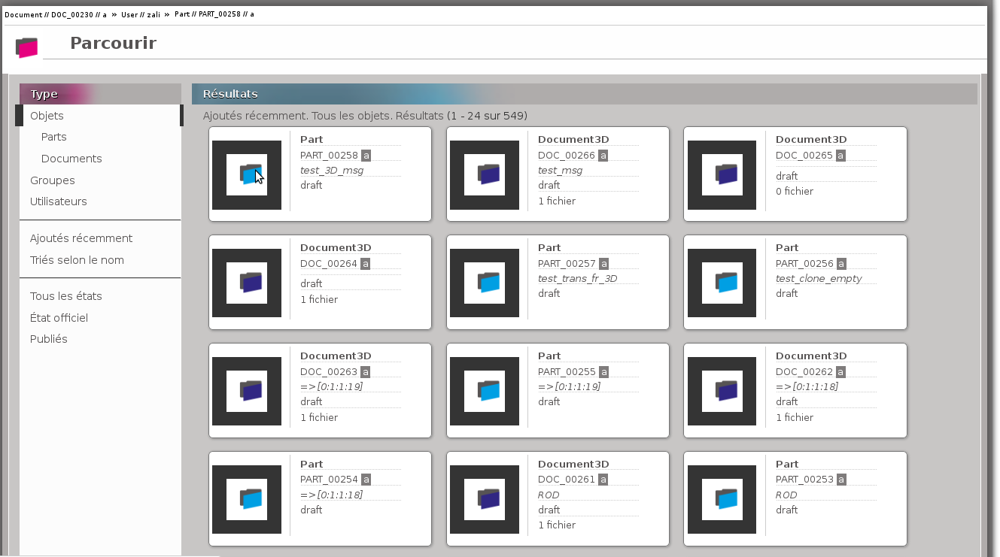
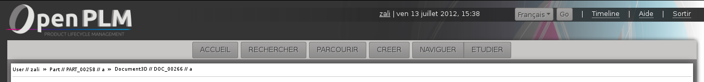

================================
Fonctions principales de openPLM
================================

Ce document décrit les concepts généraux et les principales fonctions de
openPLM, le premier véritable PLM Open Source.

Pré requis
==========

OpenPLM est une application web, vous n'avez donc besoin que d'un navigateur
Internet pour l'utiliser. Nous vous recommandons Mozilla Firefox 3.6 et plus
récent.

Dans OpenPLM, il y a 4 types d'objets principaux : 

* Utilisateur

* Groupe

* Article (Part)

* Document

Les articles et les documents sont nommés suivant en accord avec la convention
suivante : 
*type//ref//rev//name*

    type
        renvoie au type de l'objet (``Part``, ``Document``, ``Document3D``...)

    ref
        renvoie à la référence de l'objet (habituellement notée : ``PART_1759`` ou ``DOC_0051``)

    rev
        renvoie au numéro de révision de l'objet (``a``, ``1.2`` ou ``A.a.1``...)

    name
        renvoie au nom de l'objet (il peut être vide)

PAGE D'ACCUEIL
==============

Il y a 5 fonctions principales : 

1- Rechercher des objets

2- Parcourir les objets en fonction de leur relations

3- Création d'objets

4- Étudier un objet (accès aux informations de l'objet)

5- Parcourir les objets

Capture d'écran :

.. figure:: images/Capture_openPLM_home.png
   :width: 100%
   :align: center
   
   Page d'accueil

Comme on peut le voir sur l'exemple, les invitations en attentes (envoyées et
reçues) sont affichées sur la page d'accueil.

RECHERCHE
=========
La page de recherche se décompose en deux parties : 

1- La zone permettant de renseigner la requête 

2- La zone où sont affichés les résultats de la recherche

En premier lieu, vous devez sélectionner le type d'objet PLM que vous
recherchez.

Ensuite, vous renseignez le champ pour affiner la recherche. Pour cela, vous
pouvez utiliser : 
 * un ensemble de mots, OpenPLM cherchera les objets dont les attributs contiennent
   les mots renseignés.
 * une requête avancée : 
    * attribute=data 
        - ``name=test`` 
        - ``name:test``
    * attribute:data OR query
        - ``type=document3D OR type=design``
    * attribute:data AND query
        - ``name=test AND (type=document3D OR type=design)``

OpenPLM affichera les éléments qui répondent aux critères renseignés.

Exemple :

   
   Exemple de recherche

   Comme vous pouvez le voir une requête vide, correspond à tous les objets.
   Ici, toutes les parts sont affichées, leurs sous-types inclus (ici SinglePart).

NAVIGUER
========

Les objets et leurs relations sont représentés dans un schéma.

Chaque boîte représente un objet : 

* en rose pour les utilisateurs 

* en bleu pour les articles

* en violet pour les documents 

Exemple :

CRÉER
=====
On peut créer un objet en renseignant le formulaire présenté.

D'autres moyens de créer des objets sont proposés sous le formulaire.

Exemple :

ÉTUDE
=====
Accéder à la page "Étudier" depuis la page d'accueil affiche l'historique des
objets liés à l'utilisateur.

Sur la page "Étudier", il est possible : 

* d'afficher les informations d'un objet 

* d'accéder à un objet pour le modifier 

Exemple :

PARCOURIR
==========
Sur la page "Parcourir" tous les objets, groupes et utilisateurs d'OpenPLM sont affichés.

Vous pouvez filtrer les résultats en fonction du type, de l'état et vous pouvez changer 
l'ordre d'affichage.

Exemple :

   

PARTIES PERSISTANTES
====================

**L'en-tête de la page**

On y retrouve :

    * Le nom de l'utilisateur
    
    * La date et l'heure
    
    * Un bouton pour changer la langue d'affichage
    
    * Un lien de déconnexion
    
    * Un lien d'aide

    * Des boutons pour accéder aux différentes fonctions

    * Un historique des objets accédés pendant la session

Si on place le curseur de la souris sur un objet dans l'historique, le menu
correspond apparaitra.

Une fois que vous êtes connecté, cette en-tête apparaît sur toutes les pages,
exceptée la page d'accueil.

**Le panneau de gauche**

Il peut être masqué ou affiché. Ce panneau offre une
zone de recherche présentant la même structure que la page RECHERCHE décrite
plus haut.

En fonction de l'objet et de la page courante, ce panneau peut offrir des
fonctionnalités supplémentaires.

Ce panneau n'apparait ni dans la page d'accueil ni dans la page de Recherche.

.. image:: images/Capture_openPLM_leftpanel.png
   :width: 100%

