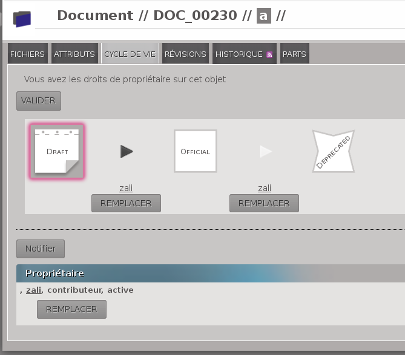

.. _whatsnew-1.1:

.. Images come later, once we are sure we would not have to update them ;)

=========================
Nouveautés d'OpenPLM 1.1
=========================

Changement pour l'utilisateur
=============================

Nouveau téléchargement de fichiers
----------------------------------

Vous pouvez télécharger (*upload-er*) vos fichiers depuis l'onglet Fichier de vos Documents tout en gardant
un oeil sur la liste des fichiers déjà présents.

Vous pouvez *upload-er* plusieurs fichiers simultanément.

Des barres de progressions apparaissent lors de l'upload des fichiers :

 * une pour chaque fichier envoyé
 * une barre de progression globale

.. list-table:: Capture d'écrant

    * - .. figure:: images/Capture_openPLM_file_add.png
           :width: 100%

           Nouvelle page "Fichiers"
    
           comme vous pouvez le voir , le formulaire d'*upload* et la liste des fichiers sont tous deux disponibles sur cette page.

    * - .. figure:: images/Capture_openPLM_file_progress.png
           :width: 100%
               
           Barre de progression
           
           OpenPLM affiche désormais des informations sur la progression des *upload* de fichiers ainsi qu'une information sur la progression globale.

Fonctionnalité **Parcourir**
-----------------------------

Une nouvelle fonctionnalité est disponible, elle permet de parcourir tous les objets (parts, documents),
groupes et utilisateurs de votre OpenPLM.

Pour plus d'information voir la documentation sur la fonctionnalité :ref:`fr-feat-browse` 

Cycle de vie et gestion
-------------------------

Les pages cycle de vie et gestion ont été fusionnées dans la page cycle de vie.

Remplacer un signataire est maintenant beaucoup plus intuitif, voir la capture d'écran ci-dessous :

Pages publiques
----------------

Vous pouvez à présent publier une part ou un document. Un objet pulié est accessible aux utilisateurs
anonymes (non-connectés).

Compte restreint et parrainage
--------------------------------------

Un nouveau type de compte est disponible : le compte restreint.

Un utilisateur ayant un compte restreint ne peut créer aucun contenu. 
Il ne peut qu'accéder à certaines parts et certains documents.

Grâce à ce nouveau type de compte, vous pourrez désormais partager des informations
avec d'autre personnes tout en étant sûr qu'ils (elles) ne pourront ni modifier le contenu partagé
ni accéder à des données confidentielles ou autres que celles partagées.

Pour créer un compte restreint vous n'avez qu'à parrainer un nouvel utilisateur et sélectionner
l'option "compte restreint".

Capture d'écran :

.. image:: images/Capture_openPLM_sponsor.png
    :width: 100%

Comme vous pouvez le voir sur l'image ci-dessus, vous pouvez aussi parrainer un nouvel utilisateur
qui peut accéder à pratiquement tous les objets mais ne peut pas les modifier.

Vous pouvez aussi sélectionner une langue pour le nouvel utilisateur. Le mail le notifiant
de la création de son compte sera traduit en fonction de la langue choisie.

Timeline
---------

La timeline est un historique global qui contients :

 * l'historique des objets officiels
 * l'historique des objets appartenant aux groupes dont vous faites partie
 
 
Flux RSS
----------

Vous pouvez souscrire aux flux RSS de :

 * objets PLM
 * Utilisateur
 * Groupe
 * la timeline

Les liens pour souscrire à ces flux sont accessibles depuis les pages :

 * "Historique"
 * "Timeline"

Chaque flux se met à jour lorsqu'une modification intervient sur  l' (les) objet(s), l'utilisateur 
ou le groupe associé(s) au flux.

Nouvelle application: oerp
---------------------------

document3D
-----------

L'application document3D a été améliorée.

Amélioration de la vue 3D
++++++++++++++++++++++++++

Surbrillance
~~~~~~~~~~~~~~~

.. todo:: screenshots, gifs

Dégradés
~~~~~~~~~~

.. todo:: screenshots

Sélectionner la vue
~~~~~~~~~~~~~~~~~~~

Une nouvelle bar d'outils permet de changer de vue (avant, au-dessus...).

.. todo:: screenshots

Couleurs aléatoires et transparence
~~~~~~~~~~~~~~~~~~~~~~~~~~~~~~~~~~~~

.. todo:: screenshots

STL 
++++++++++++++

La vue 3D affiche aussi les fichiers type STL (ASCII et formats binaires).

Aperçu des fichiers STEP
+++++++++++++++++++++++++

OpenPLM peut désormais générer l'aperçu d'un fichier STEP. Pour l'instant, 
seuls les fichiers STEP non décomposés sont gérés.

.. todo:: example

Accès WebDAV
--------------

Bugs réparés
-------------

**Suggestion de référence pour les objets PLM**

`108 <http://wiki.openplm.org/trac/ticket/108>`_ step management - Suggested part references are all the same

`113 <http://wiki.openplm.org/trac/ticket/113>`_  Part - Suggested reference may cause some problem

`117 <http://wiki.openplm.org/trac/ticket/117>`_ Object creation - If you update the page suggested reference and reference change

**Nomenclature**

`121 <http://wiki.openplm.org/trac/ticket/121>`_ BOM - Display last level is not correct

**Document3D**

`104 <http://wiki.openplm.org/trac/ticket/104>`_ 3D data not copied when a Document3D is revised

`106 <http://wiki.openplm.org/trac/ticket/106>`_ document3D: can not decompose a step file defining two products with the same name

**Gestion des fichiers**

`124 <http://wiki.openplm.org/trac/ticket/124>`_ File check-in broken

**Parrainage**

`109 <http://wiki.openplm.org/trac/ticket/109>`_ Sponsorship - Character ' is authorised for username and leads to a bug

**Delegation de droits**

`119 <http://wiki.openplm.org/trac/ticket/119>`_ Delegation - We can delegate someone who is not in the same groupe as the object

Autres amélioration
--------------------

**Nomenclature** 

 * téléchargement sous format PDF
 * remplacer un assemblage

**Naviguer**

Si l'objet courrant est une part vous pouvez :

 * lier un nouveau document,
 * ajouter une nouvelle part (fils).
 
Si l'objet courrant est un document vous pouvez :

 * lier une nouvelle part.
  

**Part et Document**

* annulation d'objets PLM
* clonage d'objets PLM

**Panneau de recherche**

La recherche est exécutée de manière asynchrone.

**Amélioration d'affichage**
 * onglet groupes
 * onglet révisions
 * ...

**Documentation** 

    * Plus de fonctionnaliés documentées
    * disponible en anglais

**Aperçu : nouveaux formats supportés**
SolidWorks, Catia, Sketch Up, Pro Engineer 

Changements administrateur
===========================

Comptes restreints et publieur
-----------------------------------

Agencement des applications
-----------------------------

Il y a eu un grand changement sur l'agencement des applications.
Les applications optionnelles ont été placées dans le dossier *apps*.

Assurez vous que votre fichier settings.py a été mis à jour en conséquence :
à l'exception de plmapp, les applications d'openPLM sont dorénavant notées openPLM.apps.NomDeLAppli .

exemple : 

'openPLM.plmapp',
'openPLM.apps.cad',
'openPLM.apps.cae',
'openPLM.apps.office',

document3D
-----------

Nouvelle dépendance optionnelle: povray

Nouvelle application : oerp
-----------------------------

Changement pour les développeurs
================================

