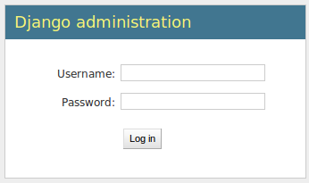
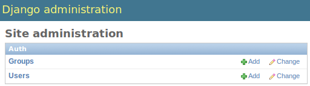
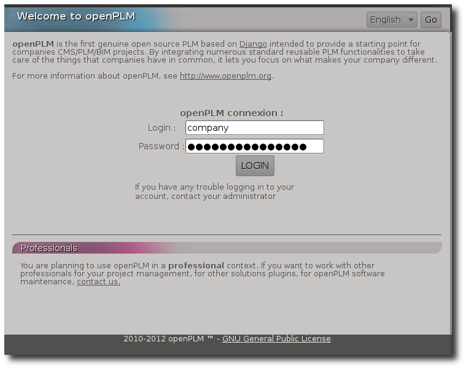

===================================================
How to install openPLM server (development version)
===================================================

This document describes how to install an openPLM server.

.. warning::

    OpenPLM 2.0 (current development version) will no longer be
    compatible with django 1.2 and the portage is in in progress.
    It is recommended to wait until the migration is done before
    installing this version. (2013/02/25)

Requirements
=============

This HowTo is based on:

    * Debian Wheezy
    * Apache Server version: Apache/2.2.22 (from Debian)
    * PostgreSQL 9.1
    * Python 2.6.X or 2.7.X
    * Django 1.5.X
    * Celery 3.0.X
    * Haystack 1.2.X
    * Xapian 1.2.X
    * Lepl 5.0
    * South 0.7.6
    * Markdown 2.2

It is also valid on Debian Squeeze (Apache 2.2.16, PostgreSQL 8.4).
 
.. note::

    Django framework can run with SQLite 3 and MySQL databases and with other web servers.
    We welcome all feedbacks about these combinations. For more information, you can visit :
    `Django website <http://www.djangoproject.com/>`_

Install necessary packages
==========================

First, you must install some dependencies:

    #. ``apt-get install swig build-essential pkg-config gettext apache2 libapache2-mod-wsgi python-pip python-dev python-imaging python-kjbuckets python-pypdf ipython graphviz graphviz-dev python-pygraphviz  python-xapian rabbitmq-server postgresql libpq-dev python-tz python-pisa libgsf-bin imagemagick python-pisa python-lxml``
    #. ``pip install odfpy docutils celery django-celery 'django==1.5.2' 'south==0.7.6' psycopg2  'django-haystack<2' librabbitmq markdown lepl`` 

To enable plain text search on files, you need to install the following
dependencies:

    #. ``apt-get install poppler-utils html2text odt2txt antiword catdoc``
    #. ``pip install openxmllib``

Get code using Subversion
==========================

    * ``apt-get install subversion``
    
    * ``mkdir /var/django``
    
All files used for a new django site will be stored in this directory.
    
    * ``cd /var/django``
    
    * ``svn co http://svn.openplm.org/svn/openPLM/``
    
The directory ./openPLM is created and all codes are downloaded.
    
    * ``cd /var/django/openPLM``

Configure PostgreSQL
====================
    
    * ``mkdir /var/postgres``
    * ``chown postgres:postgres /var/postgres/``
    * ``find / -name initdb`` ::
    
        /usr/lib/postgresql/8.4/bin/initdb
        
    * ``locale-gen fr_FR.UTF-8``
      (replace ``fr_FR.UTF-8`` with your locale) 
    * ``su postgres``
    * ``/usr/lib/postgresql/8.4/bin/initdb --encoding=UTF-8 --locale=fr_FR.UTF-8 --pgdata=/var/postgres/``
    * ``/usr/lib/postgresql/8.4/bin/postgres -D /var/postgres &``
      (it is not a problem if postgres is already running, you do not have to restart it)
    * ``psql``:

        .. code-block:: psql
    
            postgres=#create database openplm;
            postgres=#create role django with password 'MyPassword' login;
            \q
    
    * ``exit``

Change the secret key
=====================

    * ``cd /var/django/openPLM/trunk/openPLM/``
    * ``python bin/change_secret_key.py``

Create the database
===================

Edit the file :file:`/var/django/openPLM/trunk/openPLM/settings.py` 
and set the database password ('MyPassword')
It must be the one set with the command ``create role django with password 'MyPassword' login;``
Here the DATABASE_USER is ``django``, not the Django admin created by
``./manage.py syncdb --all``.

For example:

.. code-block:: python
    :emphasize-lines: 7 

    # settings.py
    DATABASES = {
        'default': {
            'ENGINE': 'django.db.backends.postgresql_psycopg2', # or 'postgresql', 'mysql', 'sqlite3', 'oracle'.
            'NAME': 'openplm',               # Or path to database file if using sqlite3.
            'USER': 'django',                # Not used with sqlite3.
            'PASSWORD': 'MyPassword',        # Not used with sqlite3.
            'HOST': 'localhost',             # Set to empty string for localhost. Not used with sqlite3.
            'PORT': '',                      # Set to empty string for default. Not used with sqlite3.
        }
    }

Then execute the following commands:

    * ``cd /var/django/openPLM/trunk/openPLM/``
    * ``./manage.py syncdb --all``
    * ``./manage.py migrate --all --fake``
    * ``./manage.py loaddata extra_lifecycles`` to load optional lifecycles
    
    .. note::
        You have to create the superadmin user for Django and a special user named 'company'.
        The company can access all contents from openPLM and should sponsor other users.
        The admin is here to administrate openPLM via its admin interface.

Compile message files
=====================

Run the following commands:
    
    #. ``make``
    #. ``./bin/translate_all.sh compile all``
   
Configure where the files are saved
===================================

Create directory where the uploaded files will be stored:
    
    * ``mkdir /var/openPLM``

    
Change rights:
    
    * ``chown www-data:www-data /var/openPLM``
     
Change rights for the directory where thumbnails will be stored:
    
    * ``chown -R www-data:www-data /var/django/openPLM/trunk/openPLM/media/``

Collect staticfiles
=======================

Run ``./manage.py collectstatic``.
This will collect static files (javascript, images, css) in
the :file:`static/` repertory.

.. _search-engine-svn:

Configure the search engine
=============================

Although haystack supports several search engines, openPLM needs xapian.
You may change the setting `HAYSTACK_XAPIAN_PATH` if you want to put the indexes
in another directory.

Once haystack is configured, you must rebuild the index:

    * ``./manage.py rebuild_index``
    * ``chown www-data:www-data -R /var/openPLM/xapian_index/``
   
.. _celery-svn:

Configure Celery
================

openPLM uses Celery to manage asynchronous tasks. Celery needs a broker, you can
choose any broker supported by celery but *rabbitmq* is recommanded.

To configure rabbitmq, you must create an user and a vhost (as root):

    * ``service rabbitmq-server start``
    * ``rabbitmqctl add_user openplm 'secret'``
      (change this password, use single quotes to put special characters or spaces)
    * ``rabbitmqctl add_vhost openplm``
    * ``rabbitmqctl set_permissions -p openplm openplm ".*" ".*" ".*"``

Then you must modify the `BROKER_*` settings in the :file:`settings.py`, if you follow this tutorial, you
only have to change `BROKER_PASSWORD`.

For example:

.. code-block:: python
    :emphasize-lines: 5

    # settings.py 
    BROKER_HOST = "localhost"
    BROKER_PORT = 5672
    BROKER_USER = "openplm"
    BROKER_PASSWORD = "secret"
    BROKER_VHOST = "openplm"

:command:`celeryd`, celery's daemon must be run. openPLM ships with an init script:

    * ``cp /var/django/openPLM/trunk/openPLM/etc/init.d/celeryd /etc/init.d/celeryd``
    * ``cp /var/django/openPLM/trunk/openPLM/etc/default/celeryd /etc/default/celeryd``
    * ``chmod +x /etc/init.d/celeryd``
    * ``update-rc.d celeryd defaults``

To launch :command:`celeryd`, run ``/etc/init.d/celeryd start``.

Configure allowed hosts
==========================

Django 1.5 checks the host before serving a request.
You must edit the :django:setting:`ALLOWED_HOSTS` setting so that
django accepts to serve your requests.

Configure Apache server
=======================

Create a new apache's site (:file:`/etc/apache2/sites-available/openplm`)
and add the following lines (replace the server name):
    
.. literalinclude:: apache/simple_2.0.conf
    :language: apache

Restart Apache server
=====================

    * ``a2ensite openplm``
    * ``service apache2 restart``

First steps in openPLM
======================

Editing the site adress
-------------------------

Edit the default Site (:samp:`http://{server}/admin/sites/site/1/`) and set the
domain name. 
This should be the same domain set in the apache file and in the ALLOWED_HOST setting.
You must login with the admin account.
You can use ``localhost`` on a local installation.

Adding users
------------

To add users in OpenPLM, you have two methods. The first one uses the
delegation tab directly in OpenPLM and the second one uses the administration
interface.

Recommanded method
~~~~~~~~~~~~~~~~~~

The first method is the recommanded way to add users to an OpenPLM instance.
The only constraint is that you need to have a working email configuration.

You need to log into OpenPLM. If you have just completed the installation, you
can log in using the company user created during installation. 

Open your web browser and go to: ::

    http://your_site_address/
    
.. note:: Here your_site_adress is given as example but you have to use your own site adress

.. image:: images/company_login.png

Then follow the steps described in :ref:`add-user`.

Create other users if needed, then logout and login as your new user account.

Second method
~~~~~~~~~~~~~

The second method to add users is **not** recomanded. Things can go wrong : 
permissions problems can occurs, and users might not be indexed. 
The only reason to use it is because you don't need a working email configuration to use it. 
But even in that case, it is recommanded to take a few minutes to configure emails and use the sponsoring method.

Open your web browser and go to: ::

    http://your_site_address/admin/
    
.. note:: Here your_site_adress is given as example but you have to use your own site adress

Enter superadmin login and password:

If you see an IOError (socket closed), checks your settings, in particular the
stuff related to Celery and RabbitMQ. 

You can add new user and edit them going to Home>Auth>User: 

Do not forget to edit Home>Plmapp>User profiles in order to give correct rights for openPLM application :

.. note::
    For more information about the `Django Admin tool <http://docs.djangoproject.com/en/dev/intro/tutorial02/>`_ . 

Then you must create a new *Site* (use the admin interface) and set the `SITE_ID`
variable in the :file:`settings.py` file.

You are now ready for your first login: ::

    http://localhost/
    

Requiring HTTPS connections
==============================

If your (apache) server support HTTPS, you can force HTTPS connections by setting the
:const:`FORCE_HTTPS` and :const:`SESSION_COOKIE_SECURE` to ``True`` in the
:file:`settings.py` file.

Each HTTP connection will be redirected to an HTTPS connection.

A possible apache configuration would be (the rewrite and ssl modules must
be enabled)

.. literalinclude:: apache/ssl_2.0.conf
    :language: apache

Configuring E-mails
===================

There are several variables that can be set in the :file:`settings.py` to configure
how mails are sent. See the `Django documentation <https://docs.djangoproject.com/en/dev/ref/settings/#std:setting-EMAIL_HOST>`_ for more details.

OpenPLM adds another variable `EMAIL_OPENPLM` which is the e-mail address set
in the `from` field of each e-mail. Usually, this is a `no-reply@` address.

Turning off the debugging mode
===============================

Once your server is configured and runs fine, you should turn off the debug mode.
Set the :const:`DEBUG` setting to ``False`` and restart celery and apache.

Troubleshootings
==================

.. contents::
    :local:

Connection refused
------------------

This error is thrown if Celery is mis-configured and can not connect to
RabbitMQ. 

See :ref:`celery-svn` for more details, make sure that RabbitMQ is running and do
not forget to edit the `BROKER_*` variables in the :file:`settings.py` file.

IOError at /object/create -- Socket closed
------------------------------------------

See `Connection refused`_.

I cannot find any objects
----------------------------

You can rebuild the search index (:ref:`search-engine-svn`) and see if openPLM
finds your parts.

It is possible that celery can not update the
search index. You can check celery's log (:file:`/var/log/celery/*.log`) and
see if it contains lines like ``[.. INFO/MainProcess] Got task from broker: openPLM.plmapp.tasks.update_index[...]``. It may be a permission problem and
``chown www-data:www-data -R /var/openPLM/xapian_index/`` may fix it.

I try to connect to http://server/ but I always get an "It works" page
----------------------------------------------------------------------

Maybe your apache installation is a little broken. Does http://server/home/
show a more acceptable result?

