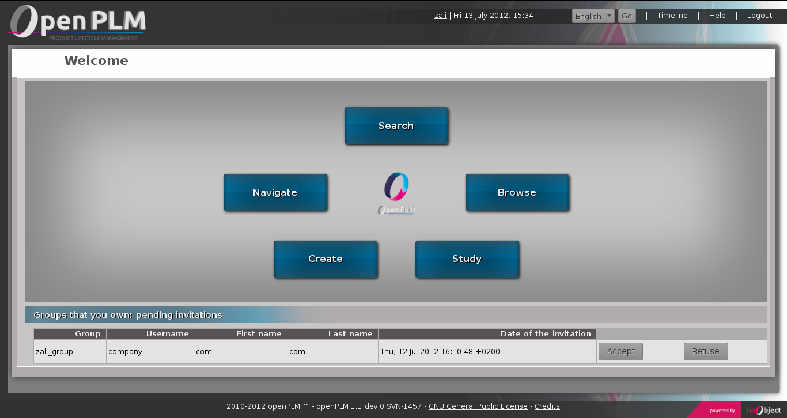
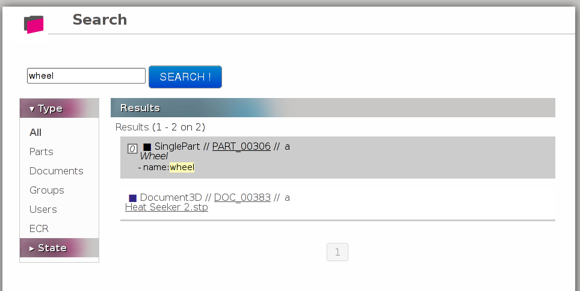
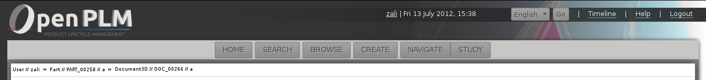
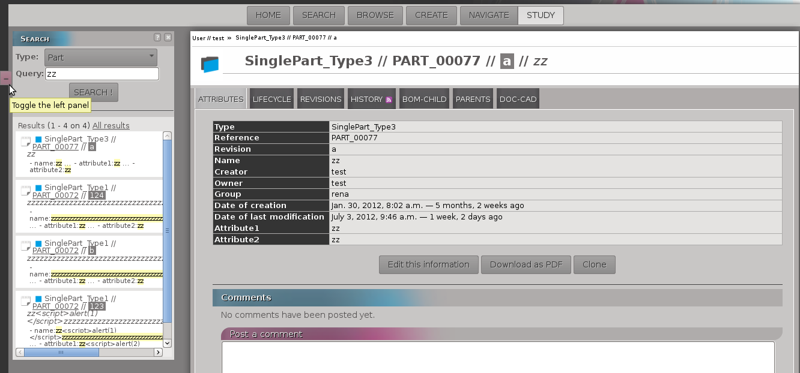

========================================================
Main functions of openPLM
========================================================

This document describes the main concepts and the main functions of openPLM,
the first genuine open source PLM.

Requirements
=============

OpenPLM is a full web application i.e. you just need a web browser.
We advise you to use a decent browser, like Mozilla Firefox, 
Google Chrome, Opera or any browsers based on Webkit or Gecko.

In OpenPLM there are four main types of objects:

* User

* Group

* Part

* Document

The parts and documents are named according to the following convention:
*type//ref//rev//name*

    type
        refers to the type of the object (``Part``, ``Document``, ``Document3D``...)

    ref
        refers to the reference of the object (usually written as ``PART_1759`` or ``DOC_0051``)

    rev
        refers to the revision number of the object (``a``, ``1.2`` or ``A.a.1``...)

    name
        refers to the name of the object (may be empty)

.. _func-home:

Home page
========================================================
You have 5 main features:

1- Search for objects 

2- Navigate with link between objects

3- Creation of objects

4- Study an object (access to the object information)

5- Browse objects

Home page screenshot:

As shown on the example, your pending invitations (sent and received) are displayed on the home page.

.. _func-search:

Search
========================================================
The search block is divided in two blocks:

1- The search block where you will enter your request

2- The part where results will be displayed

First, you need to select the type of PLMObject you want to look for.

Then, you can fill the form if you want to refine your research with:
 * a set of words , OpenPLM will display the attributes which contains all of the given words
 * advanced queries:
    * attribute=data 
        - name=test 
        - name:test
    * attribute:data OR query
        - type=document3D OR type=design
    * attribute:data AND query
        - name=test AND (type=document3D OR type=design)

OpenPLM will display the attributes which correspond to the query set.

Example:

Navigate
========================================================
Objects and their links are represented in a graph.

Each box represent an object:

* Pink is for users

* Blue for parts

* Purple for documents

Example:

.. image:: images/Capture_openPLM_navigate.png
   :width: 100%

Create
========================================================
You can create an object filling the form displayed.

Others ways to create objects are proposed under the form creation.

Example:

Study
========================================================
Reaching "Study" from the Home page show the history of the objects related to the user.

On the "Study" page you can:

* display informations of an object

* reach and modify an object

Example:

.. image:: images/Capture_openPLM_study.png
   :width: 100%

Browse
======================================================
The "Browse" page display all objects, groups and users available in your OpenPLM.
You can filter the results with the Type panel.

Example:

.. image:: images/Capture_openPLM_browse.png
   :width: 100%

Common Parts
=======================================================

**The header**

It contains:

    * User's name
    
    * Today's date and hour
    
    * Button to choose the language
    
    * Link to log out
    
    * Link to get help

    * Buttons to reach different views

    * A history of objects reached during your session

If you place your mouse over an object in the history, the corresponding menu will be shown.

Once you logged in, this header appears in all views except the home page.

**The left panel**

It can be showed or hidden. This left panel is a search
area with the same structure as the SEARCH view described higher

Depending on the current object and the current page this panel can have extra functions.

This panel does not appear in the home page and the "Search" page.

