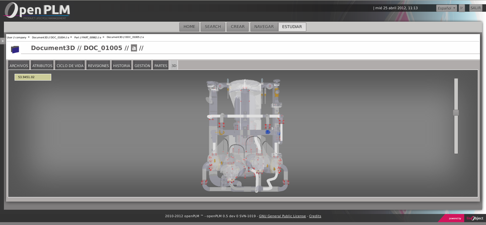

=================================================
Fonctions spécifiques au PLMObject : **DOCUMENT**
=================================================

PARTS
=====
Affiche les Parts liés au Document courant.

Si vous avez les autorisations nécessaires, vous pouvez **Ajouter** une
nouvelle Part.

Si vous avez les autorisations nécessaires, vous pouvez **Supprimer** une Part.

FICHIERS
========
Affiche les fichiers uploadés dans le Document courant.

Vous pouvez :
    * télécharger des fichiers
    * Si vous avez les autorisation nécessaires,  ajouter/uploader des
      fichiers
    * Si vous avez les autorisation nécessaires, faire des check-out
      (télécharger et verrouiller un fichier)
    * Si vous avez les autorisation nécessaires, faire des check-in (uploader
      et déverrouiller un fichier)

3D DOCUMENT
===========
3DDocument est un type de document possédant toutes les fonctionnalités de la
sous-classe Document de PLMObject. Elle est utilisée pour décrire la géométrie
d'un objet. Cette géométrie est généralement définie dans des fichiers STEPs
(extensions *.step* ou *.stp*).

Si le document est un Document 3D, une représentation 3D est généré en
utilisant le fichier lié.

Exemple de représentation 3D : 

