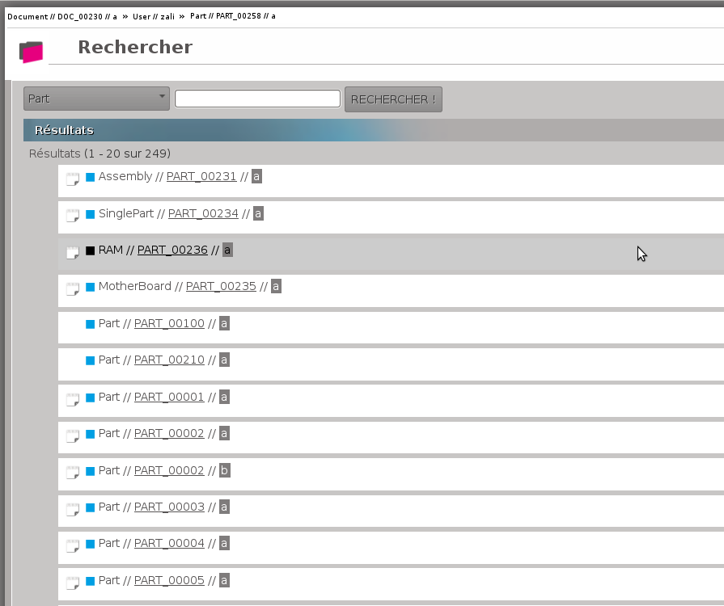
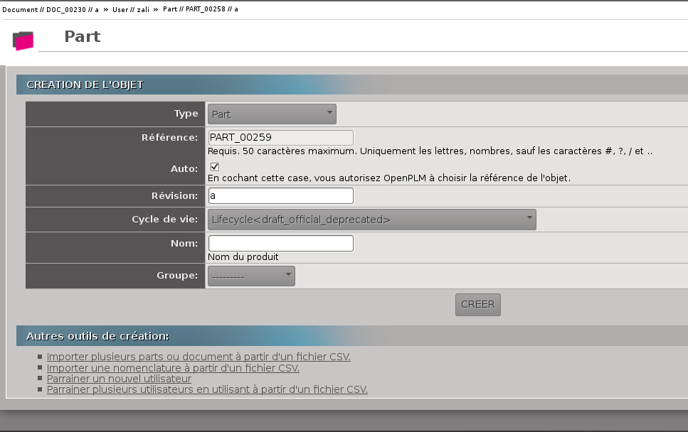
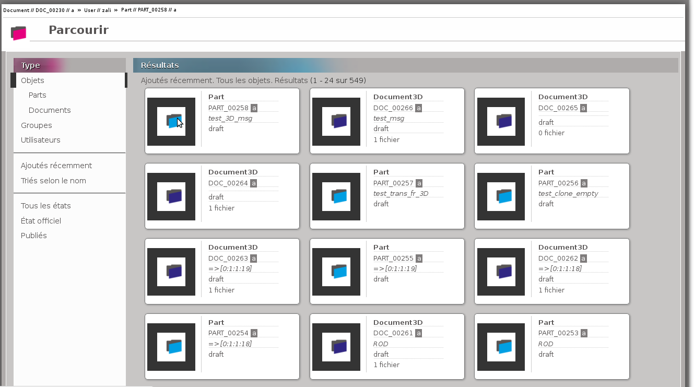
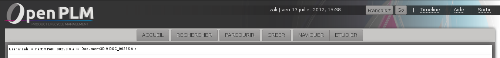

================================
Fonctions principales de openPLM
================================

Ce document décrit les concepts généraux et les principales fonctions de
openPLM, le premier véritable PLM Open Source.

Prérequis
==========

OpenPLM est une application web, vous n'avez donc besoin que d'un navigateur
Internet pour l'utiliser. Nous vous recommandons d'utiliser un navigateur
convenable comme Mozilla Firefox, Google Chrome, Opera 
ou tout navigateur basé sur Webkit ou Gecko.

Dans OpenPLM, il y a 4 types d'objets principaux : 

* Utilisateur

* Groupe

* Article (Part)

* Document

Les articles et les documents sont nommés en accord avec la convention
suivante : 
*type//ref//rev//name*

    type
        renvoie au type de l'objet (``Part``, ``Document``, ``Document3D``...)

    ref
        renvoie à la référence de l'objet (habituellement notée : ``PART_1759`` ou ``DOC_0051``)

    rev
        renvoie au numéro de révision de l'objet (``a``, ``1.2`` ou ``A.a.1``...)

    name
        renvoie au nom de l'objet (il peut être vide)

Page d'accueil
==============

Il y a 5 fonctions principales : 

1- Rechercher des objets

2- Parcourir les objets en fonction de leur relations (Naviguer)

3- Création d'objets

4- Étudier un objet (accès aux informations de l'objet)

5- Parcourir les objets

Capture d'écran :

   
   Page d'accueil

Comme on peut le voir sur l'exemple, les invitations en attentes (envoyées et
reçues) sont affichées sur la page d'accueil.

Rechercher
==========

La page de recherche se décompose en deux parties : 

1- La zone permettant de renseigner la requête 

2- La zone où sont affichés les résultats de la recherche

En premier lieu, vous devez sélectionner le type d'objet PLM que vous
recherchez.

Ensuite, vous renseignez le champ pour affiner la recherche. Pour cela, vous
pouvez utiliser : 

 * un ensemble de mots, OpenPLM cherchera les objets dont les attributs contiennent
   les mots renseignés.
 * une requête avancée : 
    * attribute=data 
        - ``name=test`` 
        - ``name:test``
    * attribute:data OR query
        - ``type=document3D OR type=design``
    * attribute:data AND query
        - ``name=test AND (type=document3D OR type=design)``

OpenPLM affichera les éléments qui répondent aux critères renseignés.

Exemple :

   
   Exemple de recherche

   Comme vous pouvez le voir une requête vide, correspond à tous les objets.
   Ici, toutes les parts sont affichées, les sous-types de parts inclus (ici Assembly, SinglePart, RAM, ...).

Naviguer
========

Les objets et leurs relations sont représentés dans un schéma.

Chaque boîte représente un objet : 

* rose pour les utilisateurs 

* bleu pour les articles

* violet pour les documents 

Exemple :

.. image:: images/Capture_openPLM_navigate.png
   :width: 100%

Créer
=====
On peut créer un objet en renseignant le formulaire présenté.

D'autres moyens de créer des objets sont proposés sous le formulaire.

Exemple :

Étudier
=======
Accéder à la page "Etudier" depuis la page d'accueil affiche l'historique des
objets liés à l'utilisateur.

La page "Etudier" dispose de plusieurs onglets à partir desquels on peut :

* accéder à diverses informations sur l'objet , le groupe ou l'utilisateur affiché

* manipuler cet objet

Exemple :

   
   Etudier
   
   Les manipulations possibles et informations accessibles depuis cette vue sont décrites ici :
   
   * :ref:`fr-plmObject-func`
   * :ref:`fr-user-func`
   * :ref:`fr-group-func`

Parcourir
==========
Sur la page "Parcourir" tous les objets, groupes et utilisateurs d'OpenPLM sont affichés.

Vous pouvez filtrer les résultats en fonction du type, de l'état et vous pouvez changer 
l'ordre d'affichage.

Exemple :

   

Parties persistantes
====================

**L'en-tête de la page**

On y retrouve :

    * Le nom de l'utilisateur
    
    * La date et l'heure
    
    * Un bouton pour changer la langue d'affichage
    
    * Un lien de déconnexion
    
    * Un lien d'aide

**La barre d'outils**

    * Des boutons pour accéder aux différentes fonctions

    * Un historique des objets accédés pendant la session

Si on place le curseur de la souris sur un objet dans l'historique, le menu
correspond apparaitra.

Une fois que vous êtes connecté, l'en-tête et la barre d'outils apparaissent sur toutes les pages,
exceptée la page d'accueil. Sur la page d'accueil seule l'en-tête est affichée .

   
   En-tête et barre d'outils
   

**Le panneau de gauche**

Il peut être masqué ou affiché. Ce panneau offre une
zone de recherche présentant la même structure que la page RECHERCHE décrite
plus haut.

En fonction de l'objet et de la page courante, ce panneau peut offrir des
fonctionnalités supplémentaires.

Ce panneau n'apparait ni dans la page d'accueil ni dans la page de Recherche.

.. image:: images/Capture_openPLM_leftpanel.png
   :width: 100%

