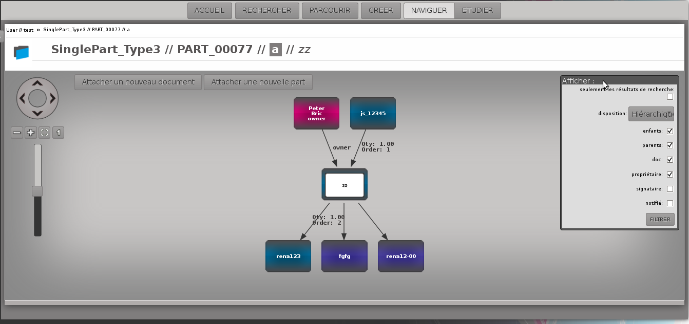

================================
Fonctions principales de openPLM
================================

Ce document décrit les concepts généraux et les principales fonctions de
openPLM, le premier véritable PLM Open Source.

Pré requis
==========

OpenPLM est une application web, vous n'avez donc besoin que d'un navigateur
Internet pour l'utiliser. Nous vous recommandons Mozilla Firefox 3.6 et plus
récent.

Dans OpenPLM, il y a 4 types d'objets principaux : 

* Utilisateur

* Groupe

* Article (Part)

* Document

Les articles et les documents sont nommés suivant en accord avec la convention
suivante : 
*type//ref//rev//name*

* *type* renvoi au type de l'objet

* *ref* renvoi à la référence de l'objet (habituellement noté type_number)

* *rev* renvoi au numéro de révision de l'objet

* *name* renvoi au nom de l'objet s'il en a reçu un

PAGE D'ACCUEIL
==============
Il y a 4 fonctions principales : 

1- Rechercher des objets

2- Parcourir les objets en fonction de leur relations

3- Création d'objets

4- Étudier un objet (accès aux informations de l'objet)

Exemple :

.. image:: images/Capture_openPLM_home.png
   :width: 100%

Comme on peut le voir sur l'exemple, les invitations en attentes (envoyés et
reçus) sont affichés sur la page d'accueil.

RECHERCHE
=========
La page de recherche se décompose en deux parties : 

1- La zone permettant de renseigner la requête 

2- La zone où sont affichés les résultats de la recherche

En premier lieu, il faut sélectionner le type d'objet PLM que vous
recherchez.

Ensuite, vous renseignez le champ pour affiner la recherche. Pour cela, vous
pouvez utiliser : 
 * un ensemble de mots, OpenPLM affichera tout les éléments qui contiennent
   les mots renseignés.
 * une requête avancé : 
    * attribute=data 
        - name=test 
        - name:test
    * attribute:data OR query
        - type=document3D OR type=design
    * attribute:data AND query
        - name=test AND (type=document3D OR type=design)

OpenPLM affichera les éléments qui répondent aux critères renseignés.

Exemple :

.. image:: images/Capture_openPLM_search.png
   :width: 100%

NAVIGUER
========
Les objets et leurs relations sont représentés dans un schéma.

Chaque boîte représente un objet : 

* en rose pour les utilisateurs 

* en bleu pour les articles

* en violet pour les documents 

Exemple :

CRÉER
=====
On peut créer un objet en renseigner le formulaire présenté.

L'utilisation du formulaire création est un autre moyen de créer des objets.

Exemple :

.. image:: images/Capture_openPLM_create.png
   :width: 100%

ÉTUDE
=====
Accéder à la partie Étude depuis la page d'accueil affiche l'historique des
objets liés à l'utilisateur.

Sur la page Étude, il est possible : 

* d'afficher les informations d'un objet 

* d'accéder à un objet pour le modifier 

Exemple :

.. image:: images/Capture_openPLM_study.png
   :width: 100%

PARTIES PERSISTANTES
====================
Certaines zone de l'affichage sont communes à toutes les fonctions
(rechercher, créer, étudier ou naviguer) : 

1- L'en-tête de la page qui contient :

    * Le nom de l'utilisateur, le jour, un bouton pour changer la langue
      d'affichage et un bouton de déconnexion.

    * Des boutons pour accéder aux différentes fonctions

    * Un historique des objets accédés pendant la session

Si on place le curseur de la souris sur un objet dans l'historique, le menu
correspond apparaitra.

.. image:: images/Capture_openPLM_header.png
   :width: 100%

2- Le panneau de gauche, qui peut être masqué ou affiché. Ce panneau offre une
zone de recherche présentant la même structure que la page RECHERCHE décrite
plus haut.

En fonction de l'objet et de la page courante, ce panneau peut offrir des
fonctionnalités supplémentaires.

