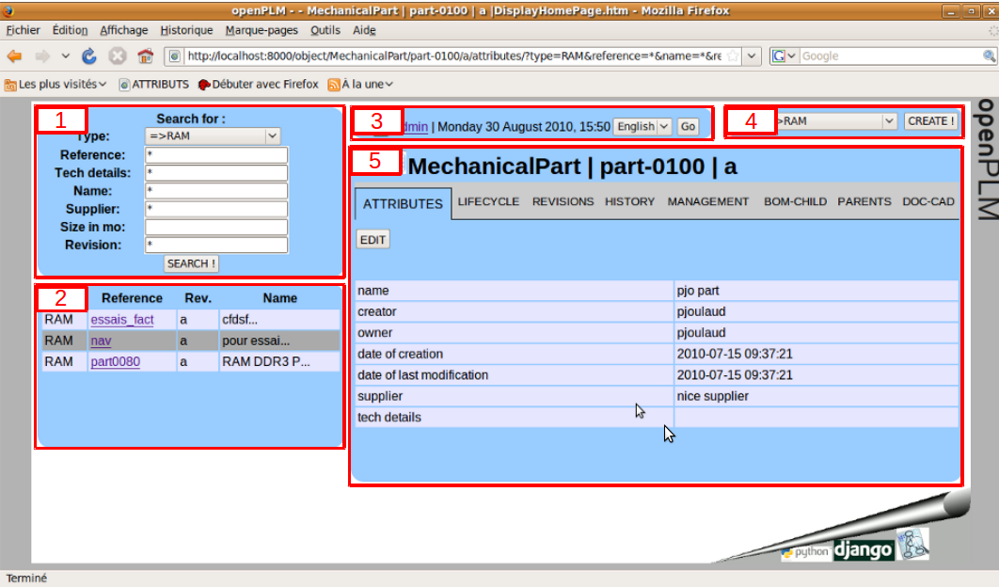
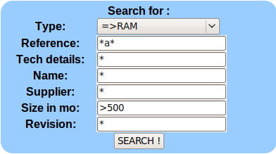
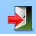

========================================================
Main functions of openPLM
========================================================

This document describes the main concepts and the main functions of openPLM,
the first genuine open source PLM.

REQUIREMENTS
=============

OpenPLM is a full web application i.e. you just need a browser.
We advise you Mozilla Firefox 3.6.

OVERVIEW
========================================================
OpenPLM is shared into 5 main areas:

1- Search area : Displays all criterions you can play with to look for an PLMObject

2- Results area : Displays the results of your research

3- Logged-in user area : Displays informations about the user who is logged in (username, current date & time, preferred language, ...)

4- Create area : Displays all criterions you can play with to create an PLMObject

5- Data display area : Displays all informations about the current PLMObject

SEARCH AREA
========================================================
First, you need to select the type of PLMObject you want to look for.

OpenPLM will display the attributes which correspond to this type.

Then, you can fill the form in order to refine your research.

You can use one or more "*" as wildcard for all attributes with text.

You can use ">" or "<" for all attributes with number.

Example :

RESULT AREA
========================================================
Here is where the result of your research is displayed.

You can click on one reference to access the corresponding objet.

If you position your mouse on the "Name" column, the full name of the PLMObject will appear.

Note : When you want to create a new link between PLMObjects, this area switchs to red with some "Add" buttons and you
can create a link between this PLMObject and the current PLMObject.

LOGGED-IN USER AREA
========================================================
Contains:

* Icon to log out OpenPLM : |logout|

* Username of the logged in User

* Current date and time

* Language preference

CREATE AREA
========================================================
First, you need to select the type of PLMObject you want to create.

Then, click on the "Create" button to access the creation page.

DATA DISPLAY AREA - MENU LIKE
========================================================
Contains :

* Icon to switch to "navigate" display : |navigate|

* Icon to switch to "menu" display : |menu|

* current PLMObject type, reference and revision.

* Displays a menu to access different data related to the current PLMObject (attributes, history, revisions, ...).

DATA DISPLAY AREA - NAVIGATE LIKE
========================================================
Contains :

* Icon to switch to "navigate" display : |navigate|

* Icon to switch to "menu" display : |menu|

* current PLMObject type, reference and revision.

* Displays a picture with PLMObjects linked to current PLMObject. You can click on them and navigate from PLMObject to others.

